# Alkalmazások fejlesztése beadandó
## Course
Készítette: Katona Bence (D7JO4Q)
### Követelményanalízis
#### Feladat és célkitűzés
A program a hirhedt Neptun rendszer egy leegyszerűsített, de határozottan nem rosszabb, megvalósítása. A fő feladat a tantárgyfelvétel, regisztráció és felhasználói adatmódosítás. A rendszer neve Course, az angol kurzus szóból származva.

#### Funkcionális követelmények:
* **Adminisztrátorként:**
  - Főoldalon bejelentkezés
  - Jelszó módosítása
  - Új hallgató felvétele (név, ckód, jelszó)
  - Új oktató felvétele (név, ckód, jelszó)
  - Új tárgy felvétele (név, tematika)
  - Tárgy oktatóhoz való hozzárendelése
  - Törlések
  - Kijelentkezés

* **Hallgatóként:**
  - Főoldalon bejelentkezés (ckód, jelszó)
  - Jelszó módosítása
  - Tárgyakra lebontva a kurzusok között szabadon böngészni
  - Oktatók között szabadon böngészni, hogy milyen tárgyakat oktatnak és melyik kurzust
  - Felvenni egy tárgyat, tehát jelentkezni egy kurzusra
  - Felvett tárgyak megtekintése
  - Leadni egy kurzust, bármikor mivel ez egy nagyon kedves egyetem
  - Kijelentkezés

* **Oktatóként:**
  - Főoldalon bejelentkezni (ckód, jelszó)
  - Jelszó módosítása
  - Új kurzust (oktatott kurzusok közül) meghirdetni tetszőleges számú hallgatónak
  - Oktatott kurzusok megtekintése
  - Kurzusra jelentkezettek megtekintése
  - Kurzus létszámának növelése / csökkentése
  - Kurzus törlése
  - Kijelentkezés

#### Nem funkcionális követelmények:
  - Ergonomikus elrendezés, felhasználóbarát felület
  - Könnyen megérthető és elsajátítható működés
  - Gyors működés
  - Biztonságos, jelszóval védett adatok
  - Egyértelmű hibajelzések
  - Könnyen karbantartható és bővíthető

#### Szakterületi fogalomjegyzék:
  - **Tárgy** - Tudományterület, amelyről tanulunk az egyetemen.
  - **Kurzus** - A kurzus az a keret, amelyben a hallgatók meghatározott rend (előadás, gyakorlat, házi feladat, stb.) szerint gyarapítják tudásukat, és arról számot is adnak.
  - **Hallgató** - Egy felsőoktatási intézményben tanuló személy.
  - **Oktató** - Egy felsőoktatási intézményben tanító személy.

#### Használatieset-modell, szerepkörök
  - **Vendég:** Csak a publikus a oldalt éri el, ami egy bejelentkezési felület
  - **Adminisztrátor:** Felhasználók felvétele, új tárgy felvétele, oktatók tárgyainak rendezése, törlési műveletek
  - **Hallgató:** Kurzusok keresése, oktatók keresése, kurzus felvétele / leadása, felvett kurzusok megtekintése
  - **Oktató:** Új kurzus meghirdetése, oktatott kurzusok megtekintése, jelentkezett hallgatók megtekintése, létszám növelése / csökkentése, kurzus törlése
  - **Közös tulajdonságok:** Bejelentkezés, jelszó módosítása, kijelentkezés
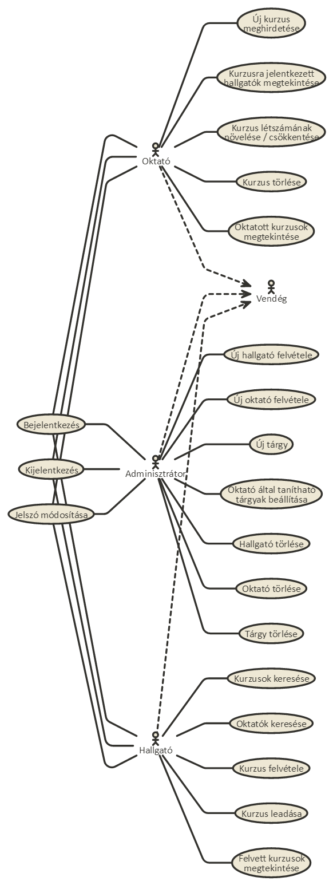

#### Példa egy folyamatra:
Hallgatóként egy kurzusra jelentkezés
  1. A felhasználó a főoldalra érkezve bejelentkezik halgatóként
  2. Megkeresi a felvenni kívánt kurzust
  3. Ha tudja elveszi, ha nem új kurzust keres
  4. Vagy végez a tárgyfelvétellel vagy felveszi a többi tárgyát is
  5. Kijelentkezik
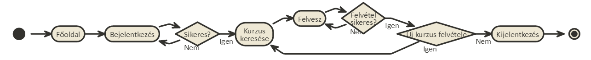

### Tervezés
#### Oldaltérkép
* **Publikus:**
  - Belépés
* **Bejelentkezett:**
  - Főoldal
    - Adminisztrátor, oktató:
      - Hallgatók
      - Oktatók
      - Tárgyak
    - Hallgató:
      - Felvett tárgyak
  - Adatok módosítása
  - Hallgatók
    - Adminisztrátor:
      - Új hallgató felvétele
      - Törlés
  - Oktatók
    - Adminisztrátor:
      - Új oktató felvétele
      - Törlés
  - Tárgyak
    - Adminisztrátor:
      - Új tárgy felvétele
  - Kurzusok
    - Adminisztrátor, oktató:
      - Új kurzus felvétele
      - Módosítás
      - Törlés
    - Hallgató:
      - Felvesz

#### Végpontok
* GET/login: bejelentkező oldal
* POST/login: bejelentkező adatok felküldése
* GET/logout: kijelentkező oldal
* GET/: főoldal
* GET/hallgatok/list: hallgatók kilistázása
* GET/hallgatok/new: új hallgató felvétele
* POST/hallgatok/new: új hallgató felvételéhez szükséges adatok felküldése
* GET/hallgatok/edit=id: hallgató módosítása
* POST/hallgatok/edit=id: hallgató módosítása, adatok felküldése
* GET/oktatok/list: oktatók kilistázása
* GET/oktatok/new: új oktató felvétele
* POST/oktatok/new: új oktató felvételéhez szükséges adatok felküldése
* GET/hallgatok/edit=id: oktató módosítása
* POST/hallgatok/edit=id: oktató módosítása, adatok felküldése
* GET/targyak/list: tárgyak kilistázása
* GET/targyak/new: új tárgy 
* POST/targyak/new: új tárgy felvételéhez szükséges adatok felküldése
* GET/hallgatok/edit=id: tárgy módosítása
* POST/hallgatok/edit=id: tárgy módosítása, adatok felküldése
* GET/kurzusok/list: kurzusok kilistázása
* GET/kurzusok/new: új kurzus felvétele
* POST/kurzusok/new: új kurzus felvételéhez szükséges adatok felküldése
* GET/hallgatok/edit=id: kurzus módosítása
* POST/hallgatok/edit=id: kurzus módosítása, adatok felküldése
* GET/profil: felhasználói adatok
* POST/profil: felhasználói adatok felküldése

#### Oldalvázlatok
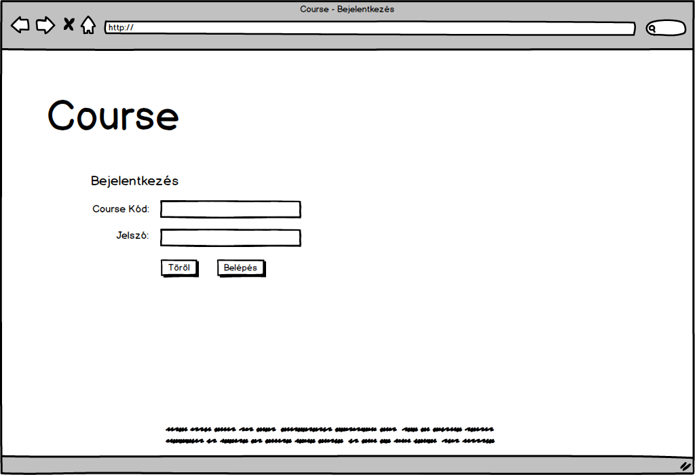
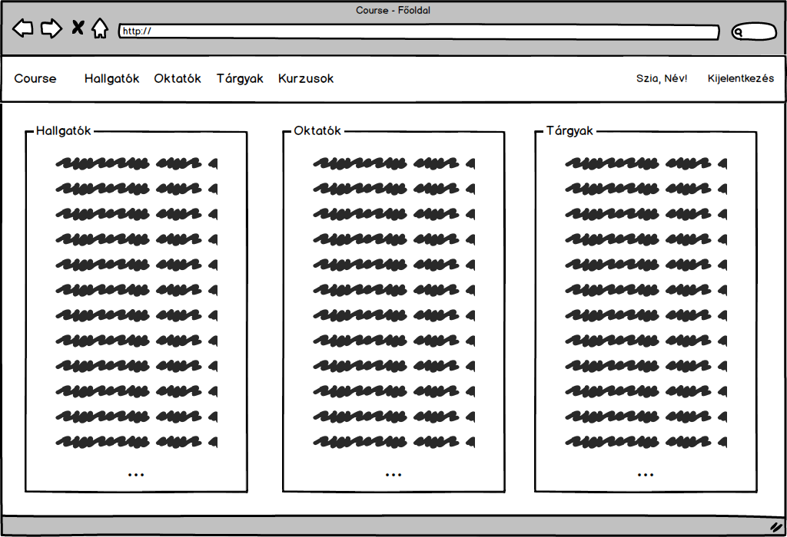
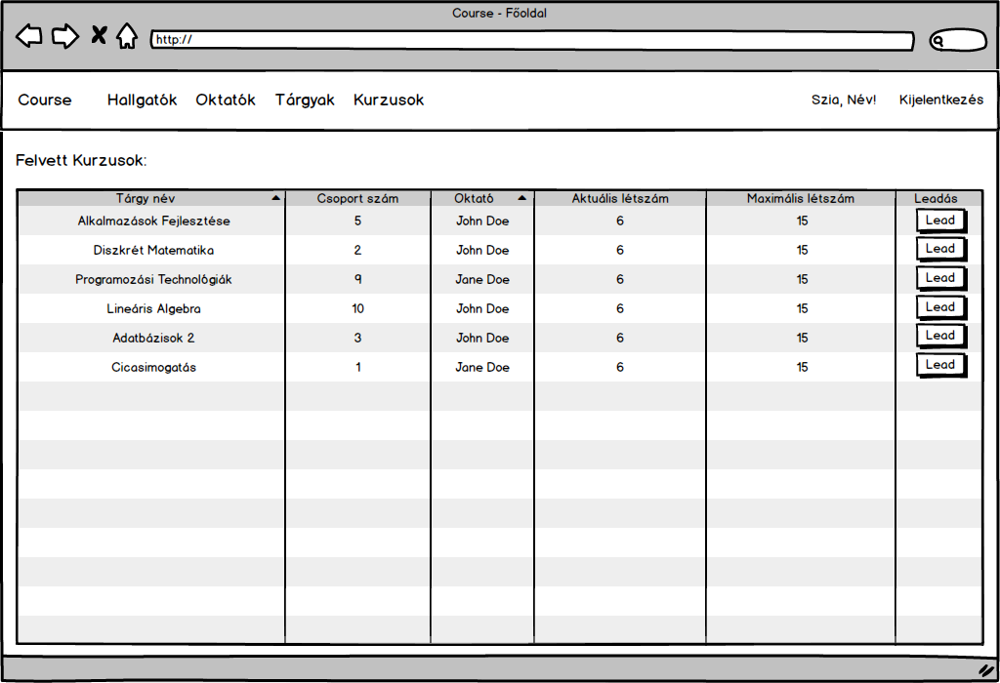
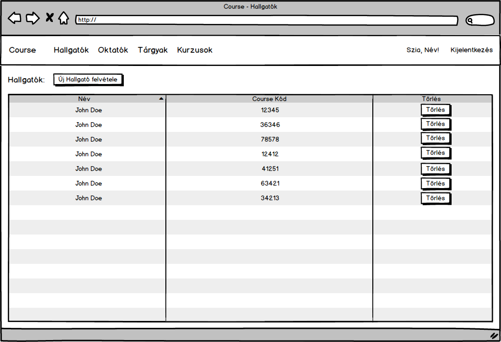
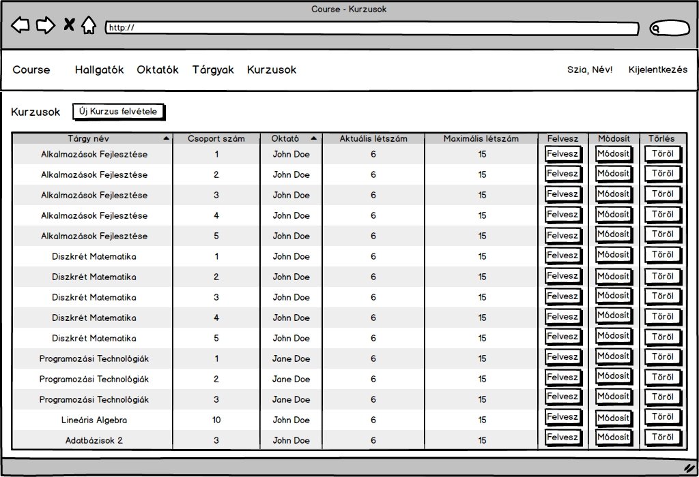
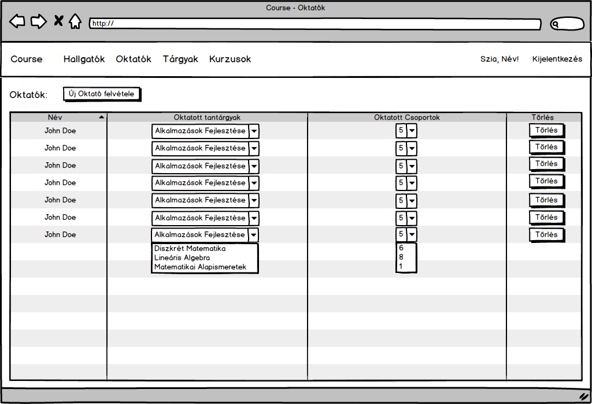
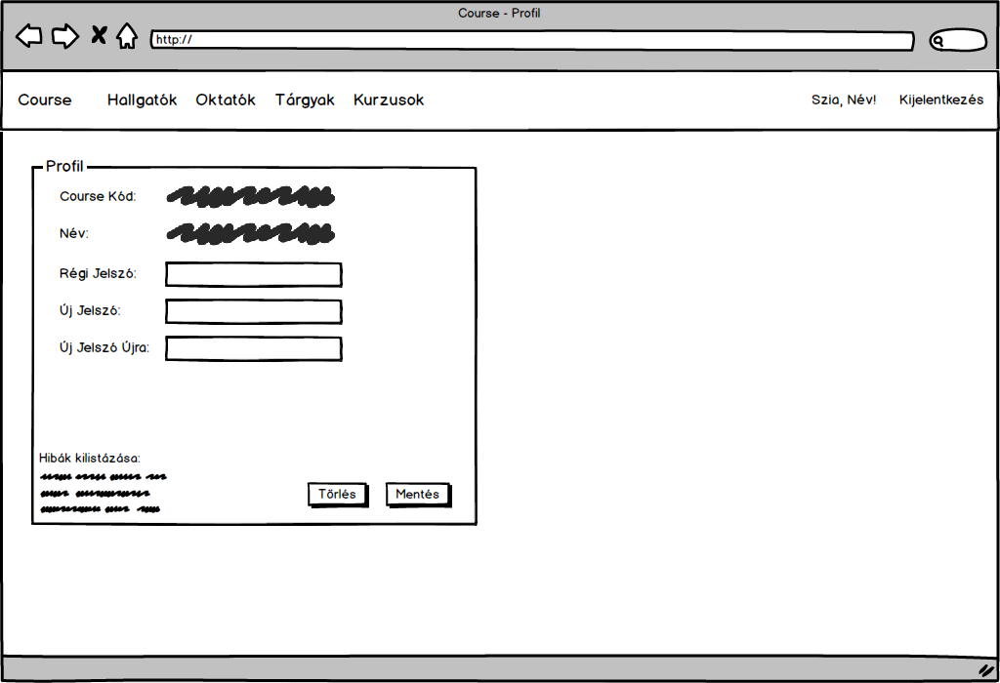
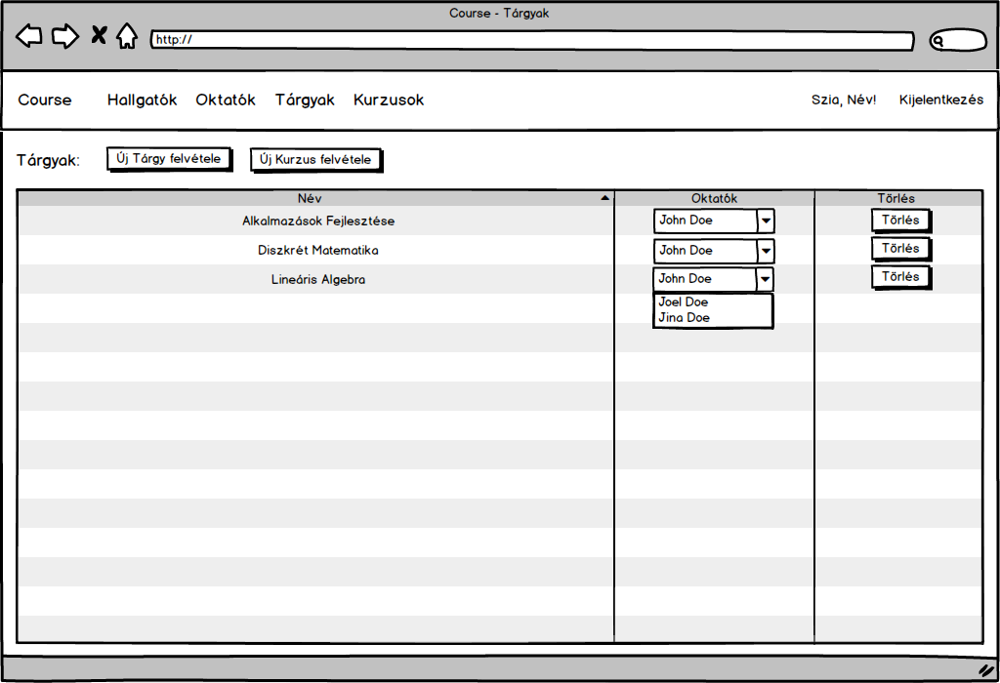

#### Osztálymodell
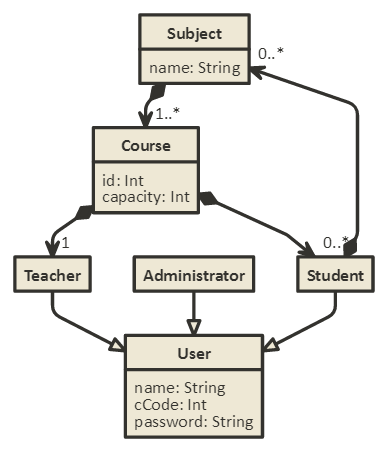
